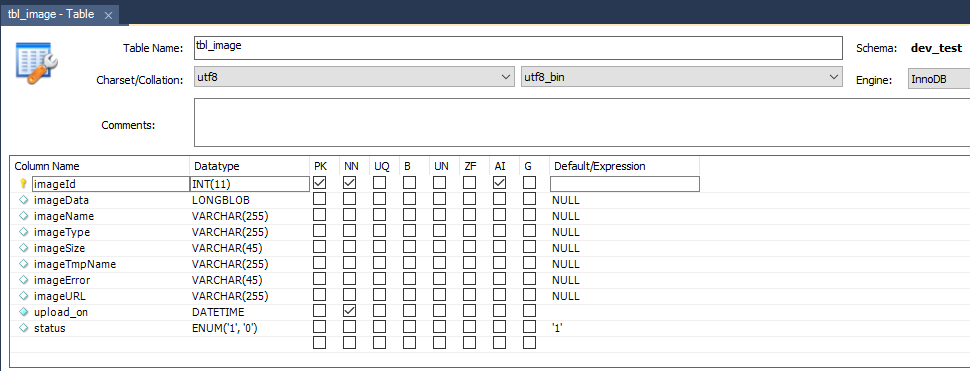
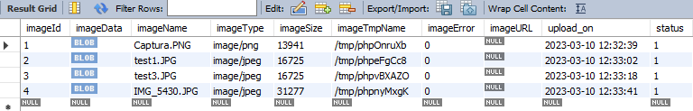
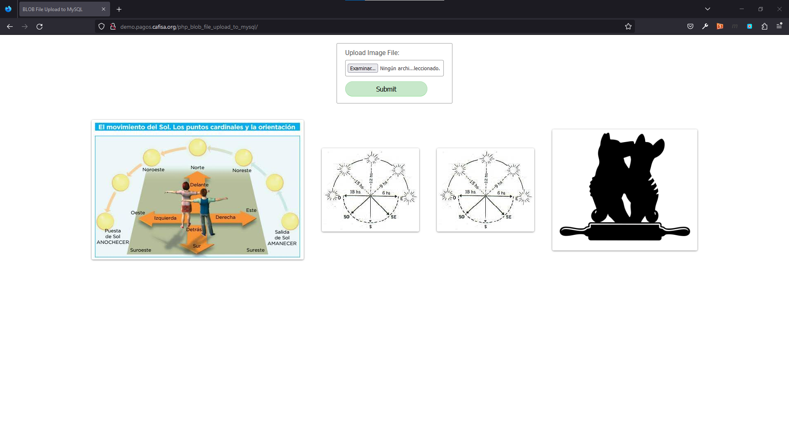

# PHP | BLOB file upload to MySQL

This project is an example of BLOB file upload to MySQL with PHP.

- [Create database](assets/database/dev_test_tbl_image.sql)
- [Connect database](db.php)
- [Upload file](index.php)
- [Insert image as MySQL BLOB](index.php)
- [Read image BLOB to display](imageView.php)
- [Display uploaded blob images in a gallery](listImages.php)

<br/>

Deployed by **[jlammx](https://github.com/jlammx)**
- 🚀 Live: [View deployment](http://demo.pagos.cafisa.org/php_blob_file_upload_to_mysql)

<br/>

The BLOB is a kind of MySQL datatype referred to as Binary Large Objects. As its name, it is used to store a huge volume of data as binary strings similar to MYSQL BINARY and VARBINARY types.

### Classification of MySQL BLOB

| MySQL BLOB Types  | Maximum Storage Length (in bytes) |
| ----------------  | --------------------------------- | 
| TINYBLOB 	        | ((2^8)-1)                         |
| BLOB 	            | ((2^16)-1)                        |
| MEDIUMBLOB 	    | ((2^24)-1)                        |
| LONGBLOB 	        | ((2^32)-1)                        |


**dev_test.sql**
```mysql
CREATE DATABASE  IF NOT EXISTS `dev_test`;
USE `dev_test`;
--
-- Table structure for table `tbl_image`
--
DROP TABLE IF EXISTS `tbl_image`;
CREATE TABLE `tbl_image` (
  `imageId` int NOT NULL AUTO_INCREMENT,
  `imageData` longblob,
  `imageName` varchar(255) CHARACTER SET utf8 COLLATE utf8_bin DEFAULT NULL,
  `imageType` varchar(255) CHARACTER SET utf8 COLLATE utf8_bin DEFAULT NULL,
  `imageSize` varchar(45) CHARACTER SET utf8 COLLATE utf8_bin DEFAULT NULL,
  `imageTmpName` varchar(255) CHARACTER SET utf8 COLLATE utf8_bin DEFAULT NULL,
  `imageError` varchar(45) CHARACTER SET utf8 COLLATE utf8_bin DEFAULT NULL,
  `imageURL` varchar(255) CHARACTER SET utf8 COLLATE utf8_bin DEFAULT NULL,
  `upload_on` datetime NOT NULL,
  `status` enum('1','0') CHARACTER SET utf8 COLLATE utf8_bin DEFAULT '1',
  PRIMARY KEY (`imageId`)
) ENGINE=InnoDB AUTO_INCREMENT=10 DEFAULT CHARSET=utf8;
```


### Screenshots

<p align="left">
	
	
    
</p>

> 🔴 Live 
<p align="left">
	<a href=https://youtu.be/YXkNRFA0Wq8 target="_blank"></a></img>
</p>


### Skills
<p align="left">
	<a href="https://dart.dev" target="_blank">
		
	</a> 
    <a href="https://www.mysql.com" target="_blank">
        
    </a>
</p>

<br/>


<p align="center">
	<div align="center" inline>
		<span> <a href="https://www.linkedin.com/in/jlammx/" target="_blank">
			</a>
		</span>
		&nbsp;&nbsp;&nbsp;&nbsp;
	</div>
</p>

<p align="center"> Last updated at 10 Mar 2023</p>
